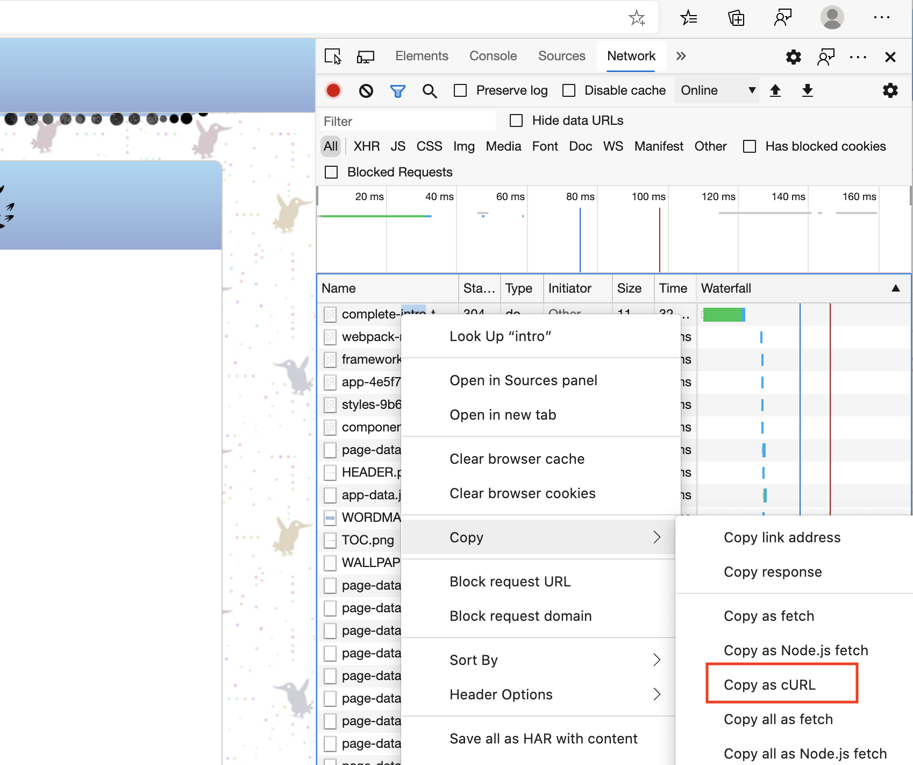

While wget works more like cp, curl works more like a normal Linux program. It works more like cat where it operates on input and output streams. Because of this it is a more useful tool to have in your arsenal because you can plug it into other programs.

So let's do some examples of how curl can be used to do testing against API servers. I frequently use curl for this (as opposed to something like Postman or Insomniac which are both great too.) First thing we're going to do is run a static file server from our home directory (on primary, fyi, we're done using the secondary machine.) Run this:

```bash
cd ~
python3 -m http.server 8000 --bind 0.0.0.0
```

This uses Python to run a little HTTP server locally. It, like `php -S`, NGINX, Apache, or any of those things of the similar nature will serve files from your local system. So if I make a request to http://localhost:8000/brian.txt I will get served whatever the file contents of brian.txt is from my home directory. Why did we choose Python here? Because Python ships with Ubuntu whereas we'd have to install other things. If you want to see what it's serving, use `ifconfig` to find your IP address and open `http://<ip address>:8000` in your browser to see what it's serving.

Okay, so now open a second shell inside primary. Easiest way is again probably to open Terminal.app/PowerShell and run `multipass shell primary` and it should hand you a new shell. Have the two shells side-by-side so you can see the output of both. Run this:

```bash
curl http://localhost:8000
```

You'll get a bunch of HTML back from the server which is the same HTML that was served to your browser. Notice in your terminal that's running the HTTP server that it's reporting the HTTP requests, the path, the incoming IP and what [HTTP verb][http] was used.

Okay, so let's run through a bunch of common things to do with curl really quick. Again, this is a deep pool. If you need to do anything with making HTTP requests (or FTP or really any network protocol) then there's a high chance that curl can do it for you. I'm just going to introduce you to how I mostly use it.

## Output

First of all, since curl is stream based, you can absolutely `curl <url> > output.txt`. This is its chief advantage over wget in my opinion. You can plug it into a greater chain of commands. You can also use `-o <file name>` to redirect output to a file or just `-O` to redirect it to a file named by the same file name e.g. http://localhost:8000/brian.txt would go to brian.txt

## HTTP Verbs

Something I'll frequently do to make sure an endpoint is working is `curl -I` (or `curl --head`). This will send a HEAD request instead of a GET request. HEAD requests just get the endpoint metadata and don't actually do a full request. This is a quick way to see if a server is ready to respond to a given request. Run `curl -I http://localhost:8000` and see what you get. Check the output from the server and see that it reports getting a HEAD request instead of a GET.

Often you'll want to do other HTTP verbs as well like POST, PUT, DELETE, and PATCH. Of those, POST is by far the most common of those. Let's see how to do a POST. Run this:

```bash
curl -X POST http://localhost:8000
curl -d "this is the body being sent with the HTTP request" http://localhost:8000
# both of these requests will fail because our static
# file server doesn't know what to do with POST requests
```

The first one, `-X` allows you to specify what verb you want to use. In this case we used `POST`. In the second case, because we're using -d to send a POST body it implicitly sets the verb to POST as well. Again, both requests will fail because our server doesn't know what to do with POST requests. We expect that.

By the same token, these will work too:

```bash
curl -X PUT http://localhost:8000
curl -X PATCH http://localhost:8000
curl -X DELETE http://localhost:8000
curl -X OPTIONS http://localhost:8000
curl -X LOL_THIS_ISNT_REAL http://localhost:8000
```

## Cookies

Another very common thing to do is have to send [cookies][cookies] with your request as well.

```bash
curl -b "name=brian" http://localhost:8000
```

This won't show up in the output of the HTTP server since it doesn't print cookies but yeah, this will send a cookie string along for the ride for you.

Cookie jar files can be useful too. If you're making a lot of requests and need to send a lot of cookies, you can put all of those into a file and use `-c <file name>` to use those as your cookies.

## Redirects

Try running this:

```bash
curl http://bit.ly/linux-cli
```

You'll notice you'll just a redirect notice. By default curl won't follow redirects. If you do `curl -L http://bit.ly/linux-cli` you'll tell curl to follow the redirect and you'll end up with the full course's website.

## Headers

Another helpful thing is to be able to include headers. You'll use `-H` and you'll do one header per `-H` (meaning you'll need multiple `-H` to do multiple different headers)

```bash
curl -H "'accept-language: en-US" -H "Authorization: Bearer 12345" http://localhost:8000
```

## Edge / Chrome / Firefox curls

One very cool feature of modern browsers is the ability to copy requests out of your network panel in your dev tools as curl requests and then be able to replay them from the command line. I do this all the time to properly formulate requests and get all the auth headers right.



## curl | bash

One last note here, a lot of tutorials or installation of tools will have you do a request of `curl <url> | bash`. This will nab the contents of the URL off the network and pipe that directly into bash which will execute what's in the contents of the network request. This should make you uncomfortable. You're basically giving whoever controls that URL unlimited access to your computer. But hey! It's really convenient too: you just get and execute the file instantly.

So what's my rule of thumb for doing that? A lot of people will tell you never, ever do it. I'll tell you _almost_ never, ever do it. There's a few things to keep in mind when you do it.

- Always read the script you're about to invoke. You know enough now to see notice anything fishy. Be especially suspicious of them making more network requests or decoding base64 strings
- Only do it from domains you trust. It's actually possible to detect a curl request as opposed to a browser request, meaning you can load the file in a browser and see something and then when you go to curl it they can serve you a different file. Basically means I only will do `curl | bash` from GitHub.
- When in doubt just `curl url > file.sh` and then read the file. From there, `chmod 700 file.sh` and `. file.sh`. It's not that many more steps.

[http]: https://en.wikipedia.org/wiki/Hypertext_Transfer_Protocol#Request_methods
[cookies]: https://en.wikipedia.org/wiki/HTTP_cookie
[bash]: https://www.idontplaydarts.com/2016/04/detecting-curl-pipe-bash-server-side/
