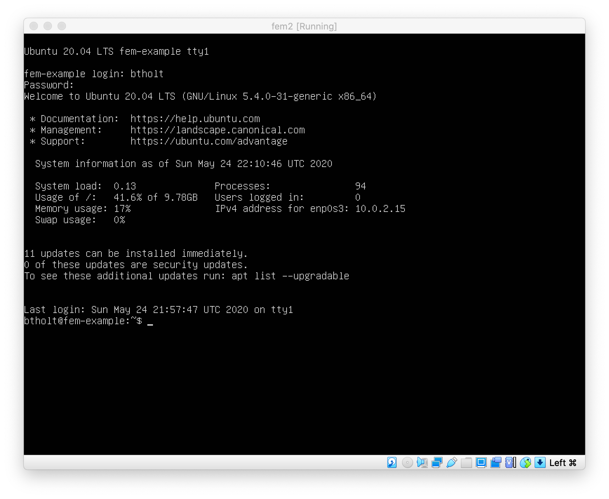
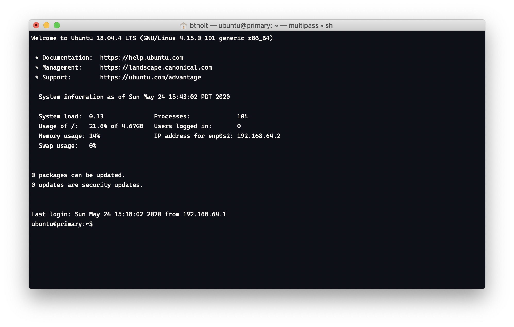

So, enough chit-chat, let's run Linux!!

You have some options, so let's go through those. Which operating system are you using right now? If you're using a desktop running Linux of some variety, you're already set and you can skip this section unless you're curious how to get up and running on macOS and Windows.

# Virtualization

We're going to running our Linux through a process call virtualization. We'll be running a virtual machine which is frequently abbreviated as VMs. VMs are an operating system running within another operating system, called the host machine. The host machine will create a virtual environment with virtual acccess to its hardware to the VM. The VM will have no idea that it's not actually running on real hardware; all it can see is the resources that the host is providing it.

So, at this point, I'll be giving you instructions on how to get a VM running on macOS and on Windows. I'll give you several options so you can do what's best fit for you.

I'll recommend most people will want to do Multipass.

# For either macOS or Windows: VirtualBox

Oracle makes a product called [VirtualBox][vb]. VirtualBox is a hosted hypervisor which is another way of saying that this is a program that allows you to run VMs. It can run Windows, Linux, macOS, and many other VMs but today all we care about is Linux. I've been using VirtualBox for years and it's a reliable product. It's not the fastest nor the most feature rich but dammit it works.

What's annoying about going down this path is that you'll need to download VirtualBox and you'll need to download the Ubuntu Server installer as well and go through the whole process. It's possible, it just takes some time. [Here's the link to the Ubuntu installer][ubuntu].

For creating the VM, just create a new Ubuntu 64 bit VM with the all default options. When you go to start it for the first time, it'll ask you to choose a boot media file. Point it at the Ubuntu 20.04 .iso file you downloaded. From here, just follow the instructions to install Ubuntu. Give it a username and password. This doesn't need to be super secure so just it a username and password you can remember. For everything else, just follow the menus and give the default responses. You don't need to connect to GitHub or anything, nor do you need any additional packages installed.

It will ask you to restart after you install so do that. Once done, you should be able to start your VM and log in to your new shell with the username and password you created. At this point, your screen shoud look something like this:

It bears mentioning that VirtualBox isn't the only option. [VMWare Fusion][vmware] and [Parallels][parallels] (macOS only) are two great options too. They just aren't free.

# For either macOS or Windows: Multipass

[Multipass][mp] is a great new tool from the folks at Canonical (who make Ubuntu). It's a super easy way to spin up and spin down little VMs to try things out. You can even spin up multiple and play with them together. I'd recommend this for most users of macOS and Windows since it just sort of works without a lot of effort and you don't have to install everything yourself.

**If you are on Windows 10 Home** you need to install VirtualBox ([link here][vb]) too in addition to Multipass. Multipass will use VirtualBox if it can't use Microsoft Hyper-V (a feature only available in Windows 10 Pro.) If you are on macOS or Windows 10 Pro, you do not need VirtualBox.

- [Here are the Windows 10 instructions][mp-windows]
- [Here are the macOS instructions][mp-macos]

Once you have Multipass installed, you should be able to run it and open a new shell. For Mac users, it'll drop a little orange icon in your command bard at the top. For Windows, it's in your system tray (typically the bottom right of your screen, look for a little orange-and-white logo.)

You should be here. It has you logged in as the user "ubuntu" who has passwordless root privileges (if you don't know what that means, you'll find out in a bit, just means you're an admin who doesn't need a password.)

# For Windows Users: WSL

If you're a Windows 10 user, you can install and use WSL. That's what I do for my local development and if you plan on being a serious developer, I'd strongly recommend installing WSL2. It allows you to run Linux natively inside of Windows. It's a bit of a burden to set up still because it's still not available in stable Windows (coming soon!) so I won't walk you through it but I'll leave the doc here if you're keen on going down that path:

[Docs for installing WSL2][wsl]

# Wrap Up

At this point, you should have a shell prompt ready to go so we can continue with the course. This was annoying but necessary! Let's keep going.

[vb]: https://www.virtualbox.org/
[ubuntu]: https://ubuntu.com/download/server
[mp]: https://multipass.run
[mp-macos]: https://multipass.run/docs/installing-on-macos
[mp-windows]: https://multipass.run/docs/installing-on-windows
[wsl]: https://docs.microsoft.com/en-us/windows/wsl/install-win10#update-to-wsl-2
[vmware]: https://www.vmware.com/products/fusion.html
[parallels]: https://www.parallels.com/
