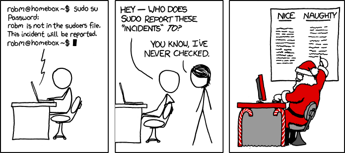

Linux is inherently a multi user system. You have an account (in our case, ubuntu is the name of the user by default for Multipass) but there are always multiple users of a Linux system. Many of the users of the system aren't even meant to be actual human users; many programs will create their own users and groups to keep themselves separate from userspace.

## Users

Run `whoami` from your command line. If you're using Multipass, it will likely say "ubuntu". This is useful in case you're not sure who is running some program. A user is what you'd expect: a user of the system. The user will have access to various files and not others. This is what you'd call permissions.

Let's see what users are already on your machine. Run `cat /etc/passwd` (notice it's passwd, not password). This will print out all of the currently registered users on your computer. Right now I have 20ish users on my system. You'll notice programs like man and mail have their own users to keep their permissions separate from yours. Why? Linux generally adheres to the principle of least power: we want programs to be given the least amount of power possible to complete their tasks. That way if they run amok, either accidentally or maliciously, the amount of damage they can cause is as minimal as possible.

## Superuser

`ubuntu` is a user and can only do things that a normal user can do. For example, a user cannot create a new user. Try `useradd brian` (or change `brian` for whatever you want the name of the new user to be.) You 'll see something saying "Permission denied". This is because only _the_ superuser can add new users. So let's try that. Run `sudo su`. We'll talk about sudo in a sec but `su` is switch user. Now try running `whoami` again. It should say "root". The root user is the superuser. Now we have ultimate power: the superuser has no restrictions on what it can do. Try running `useradd brian` and you'll see you run it with no problem.

What we did, `sudo su` is usually not what you want to do. When you do things as root, it means usually that only root in the future will be able to modify and delete files it makes. It also means that if you fat finger a command and accidentally type something wrong, you really can burn down the house. It's like using a flamethrower to start a grill: you can do it but there's a good shot you're taking the house down with you.

To get out of being root, just hit CTRL+D or run `exit`. You should be back to being ubuntu.

## Sudo


Sudo is [Sarah Drasner's _adorable_ dog][sarah] who I just love. If you haven't watched any of Sarah's courses they're **amazing**.

Let's try deleting that brian user we added. Run `userdel brian`. It should tell you you can't again because of permissions. So let's run just one command as root. Use `sudo userdel brian`. `sudo` mean "switch user and do". If you don't tell it which user to switch to, it defaults to root (and 99.99% of the time it's what you meant to do.) This is great for things like this: ubuntu can't accomplish this so I have to use root. Instead of fully switching into root, I do one command as root and quit. Try `sudo whoami` to see that it says for that one command you're root.


xkcd comic by Randall Munroe, [link here][sandwich]

It sort of feels a bit like [Simon Says][simon], right?

So why can ubuntu masquerade as root? It's because ubuntu (the user) has superuser privileges, or sometimes is called sudoer. Let's try being a user that can't sudo.

```bash
sudo useradd brian
sudo passwd brian
# make a password, I made something simple like "asdf"
su brian
# your new password
whoami
sudo su
# brian is not in the sudoers file.  This incident will be reported.
```



xkcd comic by Randall Munroe, [link here][incident]

As illustarted above, don't worry about the "incidents". I used to worry that I was doing something wrong and the dean of the CS department was going to call me into his office. Turns out they didn't even know how to check those incidents.

Okay, so nowe have a new user, brian, but brian can't sudo. How do we fix that? Groups!

## Groups

Just like we can add and subtract permissions from a user in Linux, we can actually do it for whole cohorts of users using groups. This is useful for many reasons. Let's say you have a server that everyone connects to get documents. You could have one cohort of users that just needs to read / download the documents. In this case, we could make a `readers` group and give them read-only permission to all files. They'll never need to (or be able to) create new files. Now if a hacker gets ahold of their credentials, they can only read files and not wreck your server. And when we add a new user, we just add them to the `readers` group and that's it! If we need to later modify it that `readers` can add files to just one directory, we can easily make that happen by adding write permissions to one directory for the readers. See how this can streamline things?

Some groups has special privileges, like the `sudo` group. These users can now `sudo` whenenver they need to. Let's add our user brian to the sudo group. Run `sudo usermod -aG sudo brian` (or `sudo usermod --append --groups sudo brian` if you want the long form) from the ubuntu account. usermod allows you to modify user accounts and `-aG` allows you to append new groups to the user. In this case, we made it so brian is now a sudoer. Try this now.

```bash
su brian
sudo whoami
```

And now you can see it respond root, which means you've successfully … sudone?

## Permissions

Right now I'm logged in as brian but I'm in ubuntu's home directory. If you're not, run `su brian` then `cd /home/ubuntu`.

Now, as brian, run `touch brian.txt`. You should see `touch: cannot touch 'brian.txt': Permission denied`. That's because everyone's home directory is locked down to themselves, so this is working as we anticipate.

Run `ls -l` Let's discuss the `-rw-rw-r--` stuff you see in the first column. These are the permissions for each file and directory in that folder. Let's break it down one-by-one. It's not imperative you memorize this, just know enough to what you're looking at.

`d rwx rwx rwx`

The first `d` or `-` represents if it's a directory or a file. Anything with a hyphen here is a normal file. Anything width a `d` here is a directory. There are other possibilities besides just those two but most of what you're dealing with is one of these two. [See here][linux] if you want to see the others.

The next three groups represent file permissions. The first groups is the file permissions for the user that owns that file. The next three are the file permissions for the group that owns that file. The last three is for everyone that is not that user or group.

For each of the three, the `r` represents read permission, the `w` represents write permission, and the `x` represents execute permission. I think is best illustrated with a bunch of examples.

`-rw-rw-r--` is a file, it has read-and-write permission for the user and the group, and read permission for everyone else, no write. The file is not executable.

`drwx------` is a directory that can only be written and modified by the user. It's unreadable and unwritable by the group and the rest of the system.

`-rwxr-xr-x` is a file, everyone can read it, everyone can execute it, and only the user can write to it.

So what is executing in this context? It means it's an executable program. If you run `ls -l /usr/bin`, you'll see many of the programs that Linux has. You'll see that these are all executable programs. That's what the `x` is, it mean that the file is a program that can be run.

We'll talk about how Linux knows where these files are in a bit, but if you run `echo $PATH` you'll see that `/usr/local/bin` is in there.

Okay, so back to where we are, if you say `touch brian.txt` as brian in ubuntu's home it won't let you. But try `sudo touch brian.txt` it will work. If you do `ls -l` you'll see it wrote the file as root instead as brian. If we wanted brian to be able to write here, we'd have to change the permissions of the ubuntu home directory (you don't want to do that.)

## chown

Okay, so let's modify some stuff then. Switch back to being the ubuntu user if you're still brian (you can run su ubuntu).

Let's make a directory in the root.

```bash
whoami # should say ubuntu
cd /
mkdir hello # permission denied, you don't have permission to do that here
sudo mkdir hello # works, but now hello is owned by root:root
ls -l # notice hello is owned by root:root
touch hello/text.txt # permission denied, you don't own hello
sudo chown ubuntu:ubuntu hello # it's <group>:<user>
ls -l # notice hello is now owned by ubuntu:ubuntu
touch hello/text.txt # works!
```

This is what chown does! It allows you to reassign ownership (**ch**ange **own**er).

In general this is not something you need to do a ton of but it's occasionally useful.

## chmod

chmod syntax is delightfully obtuse. Did you come in prepared to do some binary-to-decimal math in your head? Because here we go.

So chmod allows you to directly change the permissions of the file rather just changing the owners. So instead saying "now ubuntu can write to this folder insetad of brian" we can say "any person in this ground can read from it" or "everyone on this computer can read from it". Let's do a few examples.

So let's try a few

```bash
whoami # should be ubuntu still
cd ~ # go to home directory
sudo touch secret.txt # make a file as root
ls -l secret.txt # -rw-r--r-- so root can read and write but no one else can
echo "very secret message" >> secret.txt # doesn't work, permission denied
sudo chmod u=rw,g=rw,o=rw secret.txt # make it so anyone can read or write to the file
echo "very secret message" >> secret.txt # works this time!
cat secret.txt # should see very secret message
```

So that's the easy-to-remember chmod syntax. Just use u=rwx syntax (omit things you don't want the permission for.) The `u` is for user, `g` is for group, and `o` is for other or everybody else. The `r` is for read, the `w` is for write, and the `x` is for execute.

Okay, so now for binary. There is a shortcut for doing this with number instead of `u=rwx,<etc>` and it involves binary. Instead of saying `chmod u=rwx,g=rwx,o=rwx file.txt` you can say `chmod 777 file.txt` and those mean the same thing. Why? Because someone was feeling very lazy.

The magic formula is that you can add 4 to the number is you want to add read, add 2 for write, add 1 for executable, and set to 0 if you want zero permissions. Then do that for each and put the numbers in the order of user, group, other. So `chmod 640 secret.txt` would make it read+write for the user, read for the group, and no permission for anyone else. Why do I teach you this? Because you'll see `chmod 777 stuff.txt` out on StackOverflow and it's a bad idea. It's a hack. It makes a file accessibile to anyone and that's a bad idea. Going back to our principle of least power, we just want to grant the minimal permissions possible.

One last one you'll see is the use of `+` and `-`. If you want to make a file executable, you can say `chmod +x secret.txt` and it'll add executable to each of the permissions. As you may imagine `chmod -x secret.txt` takes it away. You can use it with w and r too, just that's not super common to do.

And that's it for permission! There's a lot more to learn here but this is a great start for you.

[sarah]: https://frontendmasters.com/teachers/sarah-drasner/
[incident]: https://xkcd.com/838/
[sandwich]: https://xkcd.com/149/
[simon]: https://en.wikipedia.org/wiki/Simon_Says
[linux]: https://www.linux.com/training-tutorials/file-types-linuxunix-explained-detail/
