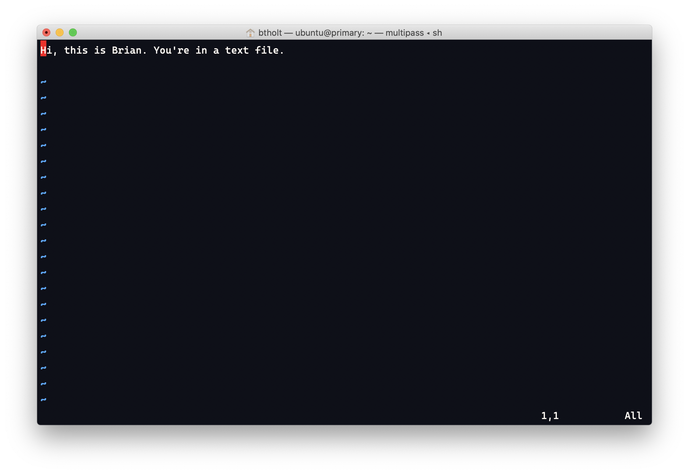

Dare I say this is the most polarizing text editor of all time. People either will die on a hill protecting its glory or love to rag on how difficult it is to use. I think they're both right to some degree. People who learn vim very well can achieve less friction between their intent and their tool which will make you very productive. However the sort of time you have to invest into your tool to achieve that is on the order of years. If you want to spend years mastering it and customizing it to your perfection, this is the tool for you. In any case, I have elected not to; I love VSCode for its useful middleground of approachable and powerful and for its incredible ecosystem of plugins.

vim has a long history but let's take a brief look at it. The genesis of the ideas that went into vim started with an editor called [ed][ed] (said ee-dee) which itself was inspired by a previous editor called [qed][qed]. ed was developed by Ken Thompson at Bell Labs in 1969. It is a line-oriented editor and I have no clue how to use it. It's actually rather well known for being pretty user unfriendly. In spite of this, it's still available on most Unix-like systems including Ubuntu and macOS. If you do start it, just know it's CTRL+D a few times to quit it. It's important to note that ed was created in a time where memory was precious, screens were tiny and sometimes just one line at a time, and modems were measured in bits, not even kilobits. It arose at a time when it fit its constraints.

From ed we got [ex][ex] (short for extended). ex was still one of these line editors but it had a nicer face on it and made a bit more friendly. ex itself learned a lot from two previous iterations, en and em. From there, Bill Joy made a screen-oriented mode (as opposed to a line-oriented one) for ex that he called vi (short just for visual). Eventually this became the dominant face of ex so much that vi became the name of the program and ex became a mode inside of vi. To this day ex mode is available in vi and vim. If you run the `ex` program from Ubuntu or macOS, it just opens vim.

And now we arrive to vim iteslf. Tim Thompson made a vi clone for the Atari ST called Stevie that Bram Moolenaar then ported to the Amiga. Bram called this Vi IMitation but later that was change to Vi IMproved. With vim, they made a bunch of quality-of-life improvements and made the product much easier to use to the point that people rarely use vi directly anymore and just use vim. If you run `vi` on macOS or Ubuntu it just runs vim.

That's probably more history than you wanted but I always found the tale fascinating. It wonderfully demonstrates how our industry progresses. The editor I work on, Visual Studio Code, owes a lot of its core ideas to vim, nano, and all the editors before them.

## Using vim

Let's start vim. Type `vim textfile.txt` to open the file you previously wrote.

vim has multiple _modes_ you can put the editor into. By default we are in command mode. So if you start typing, nothing will appear and you may actually accidentally trigger some commands. If you want to kick the editor into insert mode, just hit `i`. You should see `-- INSERT --` at the bottom to let you know you can type now. I'm going to put `And now I'm writing this from vim.` at the bottom of the file. Once I'm done writing and want to head back to command mode, you can hit Esc. You'll see the `-- INSERT --` disappear.

vim has an absolute myriad of commands and I'm not going to get into it. A good example is that here in command mode, you can use H to move the cursor left, j goes down, k goes up, and l goes right (the arrow keys work too but vim masters try to not take their fingers off the home row keys.) If I highlight a character and hit x, it'll delete that character. If I move my cursor to a line and type `:d` it'll delete the whole line. If I type `:d3` it'll delete three lines. There are so, so many and you just have to learn them.

If you do desire to go in-depth on vim, you can do one of two things. One is to type `:help tutor` from the command mode and it'll start the tutor. A more fun way is [vim adventures][vim-adventures] which is a fun game to learn the keys.

So, now we have our file modified the way we want to so let's save. Type `:w`. That's how you save. Now you can quit without a warning. Type `:q` and you'll quit out. If you want to do that in one motion, type `:wq` and it'll write then quit.

If you try to quit with unsaved changes it won't let you. You either have to save or you can type `:q!` and it will quit without saving.

Lastly, as we all find ourselves sometimes, `:q` may not work. The end-all way is `:qa!` which basically says "try to gracefully quit everything and if not, just quit anyway."

The one editor I didn't talk about but you should know about is [emacs][emacs]. Feel free to glance it but I've never found myself in a situation that I've had to use emacs so we'll continue on.

[ed]: https://en.wikipedia.org/wiki/Ed_(text_editor)
[ex]: https://en.wikipedia.org/wiki/Ex_(text_editor)
[qed]: https://en.wikipedia.org/wiki/QED_(text_editor)
[vim-adventures]: https://vim-adventures.com/
[emacs]: https://www.gnu.org/software/emacs/
